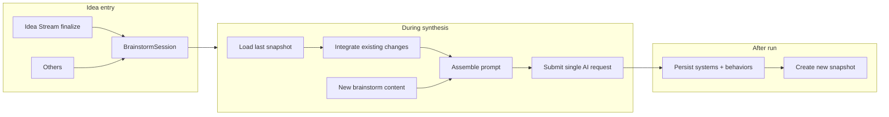

# AI Submission and Generation Logic — Plan

**Status:** Approved (documented)  
**Companion to:** [game-idea-synthesizer-PRD.md](../game-idea-synthesizer-PRD.md), [design-specification.md](../design-specification.md)  
**Code mapping:** See §6.

This plan defines the AI submission and generation logic: a single source of truth for idea storage and documentation generation. When new ideas are added (brainstorm, idea stream, others), the system uses full project context; a persisted context snapshot is created when synthesis runs so the next iteration builds on it instead of reconstructing context from scratch. Context and docs include per-system **behaviors** so submission and generation are behavior-aware. Optional **conversational AI** (§9) allows multi-turn refinement during synthesis (plan-mode-like) and focused per-system chat to iterate on a single system, with token-conscious defaults (bounded history, optional context expansion).

---

## Goals (from your direction)

- **Source of truth:** Idea storage and documentation generation share one authoritative view (project + systems + sessions + versions).
- **Full context for new ideas:** When new ideas are added (brainstorm, idea stream, others), the system uses the entire context of existing and previous systems, versions, and sessions to determine how systems should work and be implemented.
- **Context snapshot:** A persisted snapshot holds project state (and changes since creation). **During synthesis**, we take the **last snapshot**, integrate **existing changes** (delta since that snapshot), and **then submit the request**—so the **current** AI request already has all previous context plus the new context. After every successful run we persist a new snapshot so the next run has a fresh base.
- **Generated docs:** Documentation is “how you take what you have and introduce the new ideas” (integration/change-oriented).
- **System behaviors:** Systems have first-class sub-elements (behaviors). Context snapshot, delta, synthesis output, and generated docs include behaviors so the AI can add or update discrete behaviors on existing systems (e.g. "allocate skill points on level-up") without treating the whole system as one blob.

---

## 1. Context Snapshot (new capability)

### 1.1 What it is

- A **stored artifact** created when synthesis runs (and optionally on other major events).
- Contains a **summary of project state** suitable for AI consumption: project metadata, existing systems (names, slugs, purpose, current/target state, dependencies), and for each system, its **behaviors** (name, type, spec, source); dependency graph summary; version plans (labels, scope, status); and a **changes summary** (what has changed since project creation or since the last snapshot).
- Used as the **base context** for the next synthesis run (or doc generation): “last snapshot + delta since snapshot” instead of re-reading all brainstorms/systems/plans from scratch each time.

### 1.2 When it’s used vs. when it’s created/updated

- **Used during synthesis (primary flow):** When the user runs synthesis, we **load the last snapshot**, integrate existing changes (delta since snapshot), add the new brainstorm content, and **submit that combined context in a single AI request**. So the current request has all previous context and the new context—no rebuilding from scratch at request time.
- **Created/updated:** **After every successful synthesis run**, create a new context snapshot so the next synthesis has a recent base. Other triggers (e.g. version finalization, “Refresh context”) can be added later.

### 1.3 What it contains (conceptual)

- **Project:** name, description, genre, platform, status, created/updated.
- **Changes since project creation (or since last snapshot):** high-level summary such as: brainstorms added (count, titles, dates), systems added/updated (slugs, version bumps), dependencies added/removed, version plans created/finalized. Stored in a structured form (e.g. JSON or structured markdown) so the next run can append only the **delta** (e.g. new brainstorm content, new system edits) to the snapshot.
- **Current systems:** for each system, compact representation (slug, name, version, purpose, current/target state, dependencies, mvpCriticality, last updated). For each system, list its **behaviors** (id, name, behaviorType, spec snippet, sourceSynthesisId if any).
- **Dependency graph:** edges and optional topological order.
- **Version plans:** versionLabel, status, included system slugs, phases/implementation order if present.
- **Delta (existing changes):** When we add “what changed since the snapshot,” we include **the actual updated content**—e.g. full or sufficient current content of each changed system/plan—so the AI sees “updated to this,” not just “was updated.” Include **behaviors added or updated** since the snapshot (per system, with actual content). Enough detail to be useful context.
- **Snapshot metadata:** `projectId`, `createdAt`, optional `trigger` (e.g. `synthesis`, `version_finalized`), optional `synthesisOutputId` or `brainstormSessionId` for traceability.

### 1.4 Storage

- **New model** (e.g. `ProjectContextSnapshot` in `prisma/schema.prisma`): `id`, `projectId`, `content` (text: JSON or markdown), `contentVersion` (schema version for future migrations), `trigger`, `relatedSynthesisOutputId` (optional), `relatedBrainstormSessionId` (optional), `createdAt`. **Storage strategy:** keep full history (one row per synthesis run); “next iteration” uses the **latest** snapshot by `createdAt` for the project.
- Repo + service in `lib/repositories` and `lib/services` to create/read the snapshot; called from synthesis pipeline and from context assembly.

### 1.5 How it’s used (during synthesis)

- **At request time (synthesis):**
  1. Load the **last project context snapshot** for the project. If none exists (first synthesis on the project), build full context from project/systems/dependencies/plans/brainstorms, send to AI, then **persist that as the first snapshot** for next time.
  2. Compute **existing changes** since that snapshot: delta = everything after `snapshot.createdAt` (compare `updatedAt` / `createdAt` on systems, plans, brainstorms, behaviors). No separate changelog table in v1. The delta must include **enough detail to be useful context**: e.g. “System X was updated **to this**” (actual new content/state), not just “System X was updated.” Include changed or new **behaviors** (per system) with enough detail for context. Same for plans and other changed entities—include what they were updated to.
  3. **Integrate** snapshot + existing changes + **new** brainstorm content (the one being synthesized) into one prompt/context.
  4. **Submit the request** to the AI with this combined context—so the current AI request has **all previous context and the new context** in a single call.
- After a successful run, **create** a new context snapshot so the next synthesis has a fresh “last snapshot” to build on.

This gives you: no rebuilding context from scratch at request time; the current request always has full prior state plus the new input.

---

## 2. Source of truth and entry points

- **Ideas:** BrainstormSession (immutable) and Idea Stream finalize → new BrainstormSession. Other entry points (manual paste, upload, future Discord, etc.) also create BrainstormSession so one pipeline handles all.
- **Structured output:** GameSystem + SystemBehavior + Dependency + VersionPlan. Synthesis can create new systems with initial behaviors, or **add/update behaviors** on existing systems. SynthesizedOutput remains the link between a brainstorm run and the extracted/converted systems and behaviors.
- **Context for AI:** Latest **context snapshot** + **delta since snapshot** (new brainstorms, system/plan/dependency changes). Doc-store and existing repos remain the source of raw data; a dedicated **context builder** produces the snapshot and delta from doc-store.

---

## 3. Synthesis pipeline (high level)

- **Input:** BrainstormSession (and optional existing output id for “re-run”).
- **Steps (during synthesis):**
  1. **Load last snapshot** for the project. If none (first run): build full context, send to AI, then persist that as the first snapshot.
  2. **Integrate existing changes**: compute delta since snapshot (entities with `updatedAt`/`createdAt` after `snapshot.createdAt`; no separate changelog table). Include **actual updated content** for each changed item (e.g. current system/plan content), not just “X was updated”—enough detail to be useful context.
  3. **Assemble prompt**: last snapshot content + existing changes + **new** brainstorm content (this session) + instructions (e.g. “identify systems, fit into existing systems, suggest dependencies”).
  4. **Submit the request**: one AI call with that combined context—current request has all previous context and the new context.
  5. Parse response into **system stubs and behavior stubs**; store SynthesizedOutput (extractedSystems + extractedBehaviors); present review UI. On Convert: create/update systems and **create/attach behaviors** (new system → behaviors as children; merge into existing → add selected behaviors to that system).
  6. **After every successful synthesis run**, create a new ProjectContextSnapshot so the next synthesis has a fresh base.
  7. **Token budget (v1):** If assembled context is large, show a soft warning (“Context is large, response may be slower”) but still send; no truncation in v1.
  8. **Run again:** When user runs synthesis again on the same session, offer **both**: (1) **Rerun** — reuse same snapshot, only new brainstorm in prompt; (2) **Update context and rerun** — rebuild full context from scratch, then run.
  9. **Dependency cycles on convert:** When creating suggested dependencies between new systems, use the existing dependency service / graph engine; if an edge would create a cycle, the service rejects it. Show the error and let the user fix (e.g. remove or change that dependency). When **merging into existing** (duplicate slug), user can assign **extracted behaviors** to the existing system; Create Selected persists systems and **behaviors** (and dependencies).
  10. **Conversational iteration (optional):** The Review step can support **multi-turn conversation** with the AI to refine the extraction before Convert (see §9). Turn 1 uses full context; follow-up turns use compact extraction state + conversation history only (no full snapshot resend). Snapshot is still created only after a successful run (when user has converted or saved the run).
- Existing [system-extraction](../app-systems/system-extraction.md) and [ai-engine](../app-systems/ai-engine.md) docs should be updated to describe this “during synthesis” flow: last snapshot + integrate existing changes + submit; and (when implemented) conversational iteration and per-system chat.

---

## 4. Generated documentation and Export center

- **Purpose:** “This is how you take what you have and introduce the new ideas.” Docs are **generated when synthesizing** (as part of or right after the synthesis run). We submit **current docs** (existing systems, etc.) with the synthesis; the **AI identifies which docs need to be updated**; we then generate or update only those docs.
- **Content:** Integration/change-oriented: current state summary, what’s new (from the brainstorm/session), how new ideas map to existing systems (new systems vs updates), dependency impacts, suggested implementation order or phase. Per-system docs include that system's **behaviors** (name, type, spec). AI can identify which **systems and/or behaviors** need updating. Scope varies by synthesis: one run might produce only a narrow system integration plan; another might touch many systems/docs.
- **Export center:**
  - **List view** (not dropdown): show all export docs in a list so per-doc actions make sense. **Filter or badge** for “Needs submission” (updated and not yet marked up to date) so the list is actionable.
  - **Per doc:** **Type/label** (e.g. “Integration guide”, “System: combat”) so the list is scannable. **Link to source:** store which synthesis run produced each doc; show “From run [date]” and “View run.” **Preview:** short preview (expand or hover) so the user can confirm which to download without opening.
  - **Per-doc actions:** **Download** (user chooses location each time — no saved default), **Copy**, **Mark as up to date** (manual). When user downloads, mark as up to date. **“Mark all as up to date”** for when the user has applied everything outside the app.
  - **State:** User needs to see which docs have been updated and need to be submitted vs which are “up to date.”
- **Implementation:** Export engine generates docs from the same context snapshot + delta (and synthesis output) used for synthesis. Export and generated docs include behaviors from context/snapshot. AI identifies which docs need updating; we create/update only those. Export center lists them with type, link to run, preview, download (path per download), copy, mark up to date, and mark all up to date.

---

## 5. System behaviors (first-class system sub-elements)

Systems are containers; each system has zero or more **behaviors** (system sub-elements) that describe discrete mechanics, inputs, outputs, UI considerations, or content. Behaviors provide traceability (which idea added which part of a system) and let synthesis add or update one or a few behaviors without rewriting the whole system.

### 5.1 Model

- **New model** `SystemDetail` in `prisma/schema.prisma`: `id`, `gameSystemId`, `name` (e.g. "Level-up reward", "Point allocation"), `detailType` (e.g. `mechanic` | `input` | `output` | `content` | `ui_hint`), `spec` (markdown), `sortOrder`, optional `synthesizedOutputId` (link to run that added it), `createdAt`, `updatedAt`. Relation: GameSystem has many SystemDetail; cascade delete when system is deleted.
- **Roll-up:** The system's rendered markdown (or section content) can be derived from its system details by mapping detailType to schema sections (e.g. mechanics → Core Mechanics, ui_hint → Implementation Notes), or system details can be rendered as a dedicated "System details" section. Implementation chooses one strategy so generated docs and context stay consistent.

### 5.2 Context snapshot and delta

- **Snapshot:** For each system, include compact system fields **and** list of its behaviors (id, name, behaviorType, spec snippet or full spec). This allows the AI to see "this system has these behaviors" and propose new or updated behaviors.
- **Delta:** When computing changes since the snapshot, include **behaviors added or updated** (by `createdAt`/`updatedAt` after snapshot). Include actual content (spec) for each changed behavior so the prompt has full context.

### 5.3 Synthesis and convert

- **Extraction:** AI response is parsed into **system stubs** and **system detail stubs** (each detail stub has name, detailType, spec, and target system slug or "new" system candidate). Stored in SynthesizedOutput as `extractedSystems` and `extractedSystemDetails` (e.g. JSON).
- **Convert:** When user creates a new system from a candidate, create that system then create SystemDetail records for any detail stubs attached to that candidate. When user **merges into existing** (duplicate slug), add selected detail stubs as new SystemDetail rows for that existing system. Dependencies and systems are created/updated as today; system details are created and linked to the correct gameSystemId and optional synthesizedOutputId.

### 5.4 Linkage

- GameSystem retains optional `synthesizedOutputId` for systems created from synthesis. SystemDetail has optional `synthesizedOutputId` so each system detail can be tied to the run (and thus brainstorm session) that introduced it. Context and generated docs can reference "from run [date]" per system detail.

---

## 6. Where this lives in the repo

- **This plan:** `DOCS/plans/ai-submission-generation.md`.
- **Code (when implemented):** New: context snapshot model and **SystemDetail** model in `prisma/schema.prisma`, repository in `lib/repositories/` (including `system-detail.repository.ts`), service and context-builder in `lib/services/`; updates: synthesis service/orchestration, AI context assembly in `lib/ai/`, export engine in `lib/services/export.service.ts`. Context builder and AI context assembly include behaviors; synthesis parse/convert and export engine read/write behaviors. **Conversational AI (§9):** new models for synthesis and system conversation messages (or one polymorphic table); chat completion helper and follow-up endpoints; Review step UI becomes "Review & iterate" with chat; system detail page gets "Discuss with AI" with optional context expansion; "Apply to system" with AI-suggested target and user confirm. **Workspace AI (§10):** workspace CRUD for provider/model configs, designation of default provider/model, consumption in wizard and system chat; suggest popular models with pros/cons (e.g. in settings or add-model UI). Existing [app-systems](../app-systems/) (ai-engine, system-extraction, export-engine, doc-store, workspace) updated to reference context snapshot, "context on synthesis" flow, behaviors, conversational flows, and workspace default + CRUD.

---

## 7. Summary diagram

---

## 8. Frontend flow (synthesize wizard)

### 8.1 What’s already wired

- **Route:** `app/(app)/projects/[projectId]/brainstorms/[sessionId]/synthesize/page.tsx` — currently a stub; will host the wizard.
- **Entry points:** (1) Session view “Synthesize” button → `/synthesize`; (2) Idea Stream “Finalize + Synthesize” → creates BrainstormSession → redirect to `.../brainstorms/[id]/synthesize`; (3) New brainstorm “Save & Synthesize” → save then redirect to synthesize.
- **Session page** already lists existing synthesized outputs with links to `synthesize?output=<id>`.
- **Design spec** ([design-specification.md](../design-specification.md)): 3-step wizard (Configure → Processing → Review); Review is the final step and includes single refine form (scope = all or selected systems), selectable system cards, and finalize (Get AI suggestion, Apply suggestion, Create selected). Components: SynthesizeWizard, WizardStepIndicator, SynthConfigStep, SynthProcessingStep, SynthReviewStep; `synthesizeStore` (or equivalent) for transient state.

### 8.2 Lightweight UX principle

- **Default configs and pre-populated values** so the user can often “review and go” with minimal input.
- **Defaults:** AI provider/model from workspace AI config (primary provider + default model); focus areas optional and pre-populated when possible (e.g. from project genre/tags or last run). Source text is the current brainstorm — already known; show a short read-only preview/snippet in step 1.
- **Step 1 (Configure)** should feel like “confirm and run”: **Always show** “Context snapshot: [date]” or “No snapshot yet.” If the latest snapshot is old, show hint: “Project context is from [date]. Consider **Update context and rerun**.” Model dropdown (default from workspace), optional focus/tags (pre-filled if we have them), source preview, primary CTA “Synthesize.” Offer **Run again** with two options: **Rerun** (reuse snapshot) or **Update context and rerun** (rebuild full context). **Keyboard:** Enter to Synthesize. No required fields beyond “user clicked Synthesize” once defaults are in place.
- **Steps 2–4:** **Step 2 (Processing):** Real token-by-token streaming; after completion show **run duration** and **token count** (always). **Step 3 (Review):** If user opened `synthesize?output=<id>`, skip here to that run; offer “Re-run with different model” (same brainstorm/snapshot, pick another provider/model). If some parsed entries are invalid (e.g. missing slug), show “Needs fix” with reason; user can edit or discard before Convert. When conversational iteration is implemented (§9), Step 3 becomes **Review & iterate**: user sees extraction plus a **chat input** to refine the extraction in multiple turns; "Continue to Convert" uses the **latest** extraction state. **Keyboard:** Enter to Continue to Convert. **Step 4 (Convert):** Checkbox list; **Discard** per candidate (don’t convert, don’t merge). Show **behaviors** per candidate system (when present). Duplicate slugs → “Merge into existing” (diff/merge UI, accept per section) or “Create as new” with **auto-suggested slug** (e.g. combat-2) from extracted name; when merging, offer to **add extracted behaviors** to existing system. Suggested dependencies shown with **checkboxes** so user can uncheck edges they don’t want. Create Selected creates systems, **behaviors**, and checked dependencies → redirect to systems list. **Keyboard:** Enter to Create Selected. If context is large, show soft warning in step 1 or 2 (“Context is large, response may be slower”). Keep step indicator and back/forward where it helps.

### 8.3 Three steps (aligned with design)

| Step | Name          | Lightweight behavior                                                                                                                                                                                                          |
| ---- | ------------- | ----------------------------------------------------------------------------------------------------------------------------------------------------------------------------------------------------------------------------- |
| 1    | Configure     | Always show “Context snapshot: [date]” or “No snapshot yet”; stale hint if old. Default provider/model; optional focus; source snippet; “Synthesize” CTA. Enter = Synthesize. Run again: Rerun vs Update context and rerun.   |
| 2    | Processing    | Token-by-token streaming; cancel optional; auto-advance to Review. **Always show** run duration and token count after completion (and in session’s synthesized outputs list).                                                 |
| 3    | Review     | **Final step.** Single refine form (no selection = refine all; select systems = refine only those). Selectable expandable system cards (include in finalize; optional per-detail exclude). Finalize: Get AI suggestion / Apply suggestion; Create selected creates/merges systems and deps. ?output= → skip here; offer "Re-run with different model." |

### 8.4 Where defaults come from

- **AI provider / model:** **Default is set at workspace level** (see §10). Synthesis wizard and per-system chat use that default; the user can **override on a per-request basis** (e.g. pick a different model in the wizard or in the system chat). Config consumed via `lib/ai/get-workspace-provider-config.ts`.
- **Focus areas / tags:** Optional. Pre-populate from project genre/tags or from the brainstorm’s tags when available; otherwise leave empty or a single optional freeform input.
- **Source content:** Always the current brainstorm session (sessionId from route); no user input. Show a short read-only preview in step 1.
- **Context (backend):** Snapshot + delta are built server-side. Step 1 always shows “Context snapshot: [date]” or “No snapshot yet” (see 8.2).

### 8.5 Opening an existing output (`synthesize?output=<id>`)

- When user opens `synthesize?output=<id>` (session page link to an **existing** SynthesizedOutput): **skip to Step 3 (Review)** for that run. User can Convert if not yet done, **“Run again”** (back to step 1), or **“Re-run with different model”** (same brainstorm/snapshot, pick another provider/model, get a new extraction).

### 8.6 Implementation notes

- **Server:** Session and project are known from route; workspace from project. Load workspace AI config and (if available) last context snapshot summary for step 1 defaults and optional “project context” line. No new route params required for defaults.
- **Client:** Wizard is client component; use `synthesizeStore` (or equivalent) for currentStep, config (with defaults set on mount from server-passed props), streamingOutput, extractedSystems, extractedBehaviors. Store and pass **extractedBehaviors** (with system slug or system candidate id) for Convert; Create Selected calls action that persists systems and behaviors. Step 1 submits to synthesis Server Action (or streaming API) with sessionId + config; backend performs “load snapshot + delta + assemble + submit” as in §3. When §9 (Conversational AI) is implemented: Review step stores conversation messages and latest extraction; follow-up turns call a chat endpoint with compact context + history.
- **Design doc:** [design-specification.md](../design-specification.md) §1.3.8 and §4.3 already describe the wizard; add a short “Lightweight UX” note: default configs and pre-populated values, minimal required input in Configure. When §9 is implemented, document "Review & iterate" and per-system "Discuss with AI" in the design spec.

---

## 9. Conversational AI (synthesis iteration + per-system chat)

Two interactive flows let users iterate with the AI instead of one-shot only, with **token discipline** so context stays bounded and costs predictable.

### 9.1 Token discipline (shared)

- **No full-project dump on every message.** Use full context only when necessary (e.g. first synthesis turn); follow-up turns use a compact representation.
- **Bounded history.** Cap conversation context to last N user + assistant message pairs (e.g. 5–8 for synthesis, 6–10 for system chat); optionally summarize older turns later.
- **Scoped context (optional).** Per-system chat can default to that system only (and optionally its direct dependencies); the user may have an option to expand context (e.g. include related systems or full project) when they want it.
- **Explicit boundaries.** Synthesis conversation is tied to one SynthesizedOutput (or "synthesis run"); system chat is tied to one GameSystem. No cross-session context unless the user starts a new flow.
- **Optional caps.** Configurable or default max tokens per request / per conversation so a long thread does not burn the budget.

### 9.2 Conversational synthesis (plan-mode-like)

**Goal:** During the synthesize flow, the user can have a **multi-turn conversation** with the AI to refine the extraction (e.g. "add a system for inventory," "merge combat and abilities into one system," "that attribute list should include Luck") instead of a single Review → Convert.

**Flow:**

- After the **first** AI response (or when opening an existing output), the wizard enters **Review & iterate** mode: user sees the current extraction (systems + behaviors, suggested deps) and a **chat input**.
- User types follow-up instructions; AI returns an **updated** extraction (revised system/behavior stubs). UI updates the Review view; user can continue the conversation or proceed to Convert.
- On "Convert," the **latest** extraction state (after all iterations) is what gets converted to systems/behaviors. Snapshot is still created only **after** a successful run (when the user has converted or saved the run).

**Context strategy (token-conscious):**

- **Turn 1:** Full context: snapshot + delta + new brainstorm + instructions → one-shot extraction.
- **Turn 2+:** Do **not** resend full snapshot + delta. Send instead: **current extraction state** (compact: system slugs, names, purpose one-liners, behavior names/types + short spec snippets); **conversation history** (last K user/assistant pairs, e.g. K = 5); **user's latest message**. Optionally instruct the model to output only the updated extraction (same schema) so the response is a revised payload, not a long narrative.

**Storage:** SynthesisConversationMessage (or equivalent): `synthesizedOutputId`, `role` (user | assistant), `content`, `createdAt`. Latest extraction lives on SynthesizedOutput; conversation is for history and for building the next prompt.

**Implemented:** Review step (final step) has a single refine form; no selection = refine entire extraction, or select systems to refine only those (refine API accepts **focusedSystemSlugs**). Selectable system cards (checkbox = include in finalize); optional per-detail exclude. Finalize section on same step: "Get AI suggestion" and "Apply suggestion" for create/merge/discard and dependencies; "Create selected" creates/merges systems.

### 9.3 Per-system AI chat (iterate on a game system)

**Goal:** From a **game system** detail page, the user can open a **focused chat** with the AI about that system (e.g. "I like the concept of hero attributes — let's brainstorm what attributes and what they should affect"). Interactive, with that system's content in context by default; user may optionally expand context.

**Flow:**

- Entry: e.g. "Discuss with AI" or "Iterate on this system" on the system view (`/projects/[projectId]/systems/[systemId]`).
- Opens a **chat panel** (sidebar, modal, or inline): messages list + input. **Default context** = this system (name, slug, purpose, current/target state, core mechanics, inputs/outputs, **behaviors**, and optionally direct dependencies). User can optionally choose to expand context (e.g. related systems or full project) when needed.
- User and AI exchange messages; **conversation history** = last N pairs (e.g. 6–10). No automatic "apply" unless the user clicks **"Apply to system"**. When they do: **the AI suggests where the content should go** (e.g. "Add as new behavior", "Update Core Mechanics", "Append to Implementation Notes"); the user **confirms or changes** that suggestion, then we apply to the chosen target (new behavior, specific section, or append to a field).

**Token discipline:** Default = this system's fields + behaviors (and optionally dependency names). If the user opts to expand context, token use grows accordingly; optional cap (e.g. first 4K chars per system) when expanded. History = last N messages only.

**Storage:** SystemConversationMessage (or AIConversationMessage with `entityType: 'game_system'`, `entityId: systemId`): `gameSystemId`, `role`, `content`, `createdAt`. Enables resume and history. One system per conversation; "Discuss with AI" on the same system can resume the last conversation or start fresh.

### 9.4 Implementation notes

- **Shared AI infra:** Reuse the same provider/config and streaming path as synthesis; add two conversation entry points: (1) synthesis follow-up (compact extraction + history), (2) system chat (system payload + history). Both can use a single chat completion helper (messages + optional max_tokens).
- **Schema:** Add tables for synthesis conversation messages and system conversation messages (or one polymorphic table). No change to ProjectContextSnapshot or SystemBehavior.
- **Order:** Implement **after** the base synthesis wizard and Convert flow. Per-system chat can be implemented in parallel or after conversational synthesis.

---

## 10. Workspace AI config and defaults

The **default AI provider and model** used for synthesis and per-system chat are **set at the workspace** and **defaulted** in the synthesis wizard (Step 1) and in system chat. The user can **change the model on a per-request basis** (e.g. different model for one synthesis run or one system chat) without changing the workspace default.

**Workspace AI config:**

- **CRUD:** Workspace must support **adding, editing, and deleting** provider/model configs (e.g. OpenAI, Anthropic, with API key, optional base URL, default model per provider). Existing [workspace](../app-systems/workspace.md) and WorkspaceAiConfig cover storage; ensure UI and actions support full CRUD (create, update, delete) and that one config can be designated as the **default** for the workspace (used when no per-request override is chosen).
- **Default for synthesis and chat:** The workspace’s default provider and model are used as the initial value in the synthesis Configure step and in the per-system "Discuss with AI" panel; user can override in that flow.
- **Suggest popular models:** Workspace UI (e.g. when adding or editing a provider/model) should **suggest popular models** with short **pros/cons** tailored to this app (brainstorming and documentation creation)—e.g. reasoning strength, cost, context length, speed—so users can choose sensibly without leaving the app.

---

## Change Log

- 2026-02: Initial plan documented in DOCS/plans (approved; implementation deferred).
- 2026-02-18: Plan updated for SystemDetail (system details) as first-class system sub-elements; context, synthesis, export, and frontend Convert system-detail-aware.
- 2026-02-18: Terminology rename: SystemBehavior → SystemDetail, behaviorType → detailType, extractedBehaviors → extractedSystemDetails, system-behavior.repository → system-detail.repository throughout plan.
- 2026-02-18: Added §9 Conversational AI (synthesis iteration + per-system chat); token discipline with optional scoped context for system chat; §3 step 10 and §6/§8 references to §9; design spec and app-system doc update callouts.
- 2026-02-18: §9.3 Apply to system: AI suggests target (e.g. new behavior, update Core Mechanics, append to Implementation Notes), user confirms or changes then apply. §10 Workspace AI config: default set at workspace, defaulted in wizard and system chat, overridable per request; workspace CRUD for provider/model configs; suggest popular models with pros/cons for brainstorming/doc.
- 2026-02-18: Implemented Review & iterate (refine API, chat panel, per-system Refine button, SynthesisConversationMessage schema) and Convert-step AI suggestion (convert-suggest API, Get suggestion / Apply suggestion).
- 2026-02-18: §8: 3-step wizard; Review is final step with single refine form (scope by selection), selectable system cards, finalize (Get AI suggestion, Apply suggestion, Create selected) on same step; refine API supports focusedSystemSlugs.
