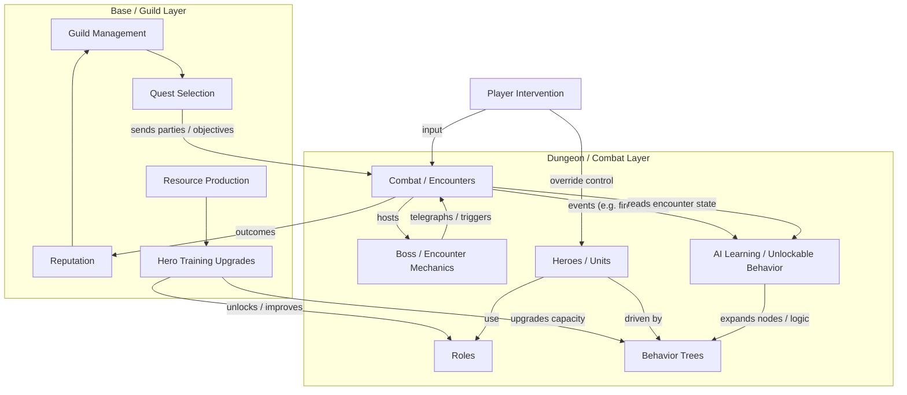

# Dependency Graph Reconceptualization and Systems Flowchart

This document plans the reconceptualization of the dependency graph as a **systems interaction flowchart**: which systems interface with which, and how. It includes a concrete dependency/flowchart for Guild of Emergent Minds and refinements to the graph feature and AI so the app produces and maintains this kind of view programmatically.

**References:** [app-systems/dependency-graph.md](../app-systems/dependency-graph.md), [plans/graph-system-and-ui.md](graph-system-and-ui.md). Example game: Guild of Emergent Minds (see its `DOCS/design-summary.md`).

---

## 1. Current vs desired meaning of "dependencies"

**Today in the app:**

- A **dependency** is a directed edge `sourceSystem → targetSystem` with type `requires` | `enhances` | `optional`.
- Semantics are **implementation order**: "source depends on target" → target should be built before source; used for topological sort, impact analysis, and cycle prevention.
- The AI suggests edges only at **convert** time (`lib/services/synthesis-convert-suggest.service.ts`) with minimal guidance: "optional array of { sourceSlug, targetSlug }" for "new systems" — no explicit framing as "who interfaces with whom."

**Desired framing:**

- The graph should answer: **"How do systems interact? Which systems interface with which, in a flowchart fashion?"**
- So the view is **system interaction / interface flow**: data flow, triggers, "system A uses / is used by / sends events to system B" — not only "A must be built after B."
- Implementation order can remain a **derived** view (e.g. topological sort from the same graph), but the primary mental model becomes **interaction flowchart**.

---

## 2. Systems flowchart for Guild of Emergent Minds

Derived from Guild of Emergent Minds design-summary: systems and how they interface.

**Systems identified:**

- **Heroes/Units** — entities with roles, operated by behavior + player override
- **Roles** — Tank, DPS, Healer; defines behavior and stats
- **Behavior trees / State machines** — how heroes act in combat and overworld
- **AI Learning / Unlockable behavior** — learns from encounters, unlocks new BT nodes and logic
- **Combat / Encounters** — dungeon rooms, fire-on-ground, line attacks, target swap
- **Boss / Encounter mechanics** — telegraphs, phases, environmental triggers
- **Base / Guild** — strategic layer: guild management, idle progression
- **Quest selection** — which dungeons/objectives; feeds into Combat
- **Reputation** — progression metric; influenced by outcomes
- **Resource production** — incremental resources at base
- **Hero training upgrades** — improves heroes and behavior capacity
- **Player intervention** — override/control any character; inputs into Combat/Behavior

**Interaction flow (who talks to whom):**

**Dependency-style edges (for build order / implementation):**

- Combat **requires** Roles, Behavior trees (needed to run combat).
- AI Learning **requires** Behavior trees (modifies them).
- Quest selection **requires** Combat (sends to dungeons).
- Base systems **require** each other in sensible order (e.g. Guild management → Quest selection; Reputation, Resources feed into progression).

This pgraph is exactly what the app should be able to **generate and maintain programmatically**: nodes = game systems, edges = "interfaces with" / "depends on" with clear semantics.

---

## 3. Refinement plan for the graph feature

### 3.1 Conceptual model (no schema change required initially)

- **Keep** the existing `Dependency` model (source, target, type, optional description).
- **Reframe** in product and prompts:
  - **Primary view:** "Systems interaction flowchart" — edges mean "system A interfaces with / uses / is triggered by system B."
  - **Secondary view:** "Implementation order" remains available via topological sort; "depends on" can still mean "must be built after" when needed for version planning.
- **Clarify edge semantics** in UI and docs: e.g. "Requires" = hard dependency + interface; "Enhances" = optional integration; "Optional" = weak or future interface. Optionally add **description** on edges so users (or AI) can note *how* they interact (e.g. "sends encounter events").

### 3.2 AI: suggesting and establishing links

- **Convert suggestion** (`lib/services/synthesis-convert-suggest.service.ts`):
  - Update system prompt to ask for **interaction links**: "For each pair where one system *interfaces with* or *uses* another (data flow, triggers, 'A sends to B'), add dependencies: sourceSlug = the system that *depends on or uses* the target (target is the dependency). Include a short rationale for dependencies (who calls whom / who feeds whom)."
  - This aligns AI output with "flowchart of system interactions" while still producing the same `dependencies: [{ sourceSlug, targetSlug }]` shape (and optionally use `description` if exposed in the API).
- **Synthesis context** (`lib/services/context-builder.service.ts`):
  - Snapshot already includes `dependencyGraph` (edges + topological order). Ensure synthesis instructions tell the model: "Use the dependency graph to understand how systems interact; when proposing new systems, propose dependencies that reflect which existing systems the new one will interface with."
- **Future (out of scope for this plan):** Dedicated "Suggest links" action: given current systems and their purpose/specs, AI suggests missing interaction edges (see [app-systems/dependency-graph.md](../app-systems/dependency-graph.md) "Suggested dependency detection via AI").

### 3.3 UI and copy

- **Dependencies page** (`app/(app)/projects/[projectId]/dependencies/dependencies-content.tsx`, [graph-system-and-ui.md](graph-system-and-ui.md)):
  - Title/copy: Frame as "Systems interaction" or "How systems connect" — e.g. "View how systems interface with each other; add links when one system uses or is triggered by another."
  - Same DAG: nodes = systems, edges = "interfaces with / depends on"; keep add/remove edge, impact mode, layout, filters. Optionally show edge **description** on hover or in side panel.
- **Implementation order** list stays as a **derived** view: "Suggested build order (from dependencies)" with a short note that it's computed from the same graph.

### 3.4 Example artifact: using the flowchart for this game

- For **Guild of Emergent Minds**, the app would (once systems are created from design or synthesis):
  - Create nodes: Combat, Behavior Trees, Roles, AI Learning, Base, Quest Selection, Reputation, Resources, Hero Training, Boss Mechanics, Heroes, Player Intervention (or merged as appropriate).
  - Establish edges as in the mermaid above (e.g. Combat → AI Learning "events", AILearning → BehaviorTrees "expands", Quest Selection → Combat "sends parties").
- The same graph engine (cycle check, topological sort, impact) continues to work; only the **meaning** of an edge and the **AI prompt** change so that the graph is clearly a "systems interaction flowchart."

---

## 4. Deliverables (when implementing)

- **Docs:** Update [app-systems/dependency-graph.md](../app-systems/dependency-graph.md): Purpose and "Current Implementation" to describe the graph as systems interaction flowchart; add "Target Evolution" note on AI suggest-links. Update [graph-system-and-ui.md](graph-system-and-ui.md) to reference interaction framing and copy.
- **AI:** Adjust convert-suggest system prompt (and any synthesis instructions that reference dependencies) to frame dependencies as interface/interaction links with optional short rationale or description.
- **UI:** Update dependencies page and any tooltips/copy to "systems interaction" / "how systems connect"; optionally surface edge description; keep Phase 2/3 roadmap (impact, layout, minimap, overview/version-plan embedding) unchanged.
- **Optional:** Store this plan's flowchart as a reference artifact (e.g. in `DOCS/plans/` or in the guild-of-emergent-minds repo) so the same game can be used as a test case for "programmatic" graph generation.

---

## 5. Summary

| Aspect | Current | After refinement |
|--------|---------|------------------|
| **Meaning of an edge** | "Source depends on target" (build order) | "Source interfaces with / uses target" (flowchart); build order derived |
| **AI suggestion** | Generic "optional dependencies" at convert | Explicit "interaction links" (who uses whom); optional description |
| **UI framing** | "Dependency graph" | "Systems interaction" / "How systems connect" |
| **Data model** | Unchanged | Unchanged (optional: use `description` for interaction note) |

The **Guild of Emergent Minds** systems flowchart above is the concrete pgraph of dependencies/interactions the app will produce in a programmatic fashion once systems and links are created from design or synthesis.

---

## Change Log

- 2026-02: Initial plan documented from dependency graph reconceptualization; systems flowchart for Guild of Emergent Minds; refinement plan (conceptual model, AI, UI, deliverables).
- 2026-02: Implementation: dependency-graph.md and graph-system-and-ui.md updated; convert-suggest prompt and context-builder instructions reframed for interaction links; dependencies page title/copy set to systems interaction, implementation order and edges relabeled, edge description shown in list, Add link copy.
